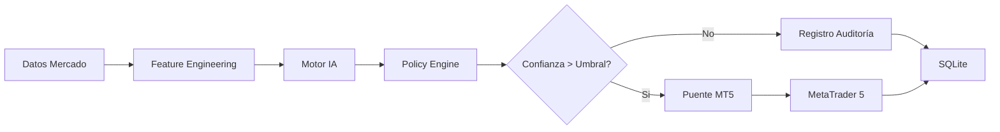

# Sistema de Luces Multi-Activo con IA y MT5

Sistema automatizado de trading algorítmico que combina análisis técnico, inteligencia artificial híbrida y ejecución directa en MetaTrader 5. Diseñado para operar múltiples activos (US500, XAUUSD, TSLA, AAPL) de forma independiente con registros de auditoría completos.

## 📋 Tabla de Contenidos

- [Características Principales](#características-principales)
- [Arquitectura del Sistema](#arquitectura-del-sistema)
- [Requisitos Previos](#requisitos-previos)
- [Instalación](#instalación)
- [Configuración Multi-Activo](#configuración-multi-activo)
- [Despliegue del Puente MT5](#despliegue-del-puente-mt5)
- [Ejecución del Sistema](#ejecución-del-sistema)
- [Operación Diaria](#operación-diaria)
- [Interpretación de Señales](#interpretación-de-señales)
- [Estructura de Directorios](#estructura-de-directorios)
- [Solución de Problemas](#solución-de-problemas)
- [Advertencias de Riesgo](#advertencias-de-riesgo)

---

## Características Principales

- **Multi-Activo**: Soporte nativo para US500 (S&P 500), XAUUSD (Oro), TSLA (Tesla) y AAPL (Apple).
- **Inteligencia Híbrida**: Motor de decisión que combina reglas expertas, estadística avanzada y detección de anomalías.
- **Ejecución Automática**: Integración bidireccional con MetaTrader 5 mediante puente TCP/IP de baja latencia.
- **Auditoría Completa**: Registro persistente en SQLite de cada decisión, señal de IA y orden ejecutada.
- **Dashboard Web**: Interfaz en tiempo real para monitoreo de estados, luces y métricas de rendimiento.
- **Seguridad Operativa**: Umbrales de confianza configurables, límites de Drawdown y modo "Solo Lectura".

---

## Arquitectura del Sistema

El sistema opera en un ciclo continuo de 5 etapas:

1.  **Ingesta de Datos**: Conexión a Yahoo Finance para obtener velas en tiempo real.
2.  **Feature Engineering**: Cálculo de indicadores técnicos (RSI, MACD, Bandas de Bollinger, ATR).
3.  **Inferencia de IA**: El motor analiza las características, detecta anomalías y asigna una puntuación de confianza.
4.  **Decisión de Política**: El PolicyEngine combina la señal de IA con reglas de negocio para definir la "Luz" (Verde/Rojo/Amarillo).
5.  **Ejecución (Opcional)**: Si la confianza supera el umbral y el modo automático está activo, se envía la orden a MT5.



---

## Requisitos Previos

### Software Obligatorio
- **Python 3.9 o superior**
- **MetaTrader 5 Terminal** (Instalado y con sesión iniciada)
- **Git**

### Cuentas de Trading
- Cuenta en broker compatible con MT5 (Recomendado: Cuenta Demo para validación inicial).
- Permisos de API habilitados en MT5 (Herramientas > Opciones > Expert Advisors > Permitir trading automático).

### Conocimientos Recomendados
- Nociones básicas de trading (Long/Short, Stop Loss, Take Profit).
- Manejo básico de terminal Linux/Consola.

---

## Instalación

### 1. Clonar el Repositorio
```bash
git clone <URL_DEL_REPOSITORIO>
cd SistemaLuces
```

### 2. Crear Entorno Virtual
```bash
python -m venv venv
source venv/bin/activate  # En Windows: venv\Scripts\activate
```

### 3. Instalar Dependencias
```bash
pip install -r requirements.txt
```
*Nota: Asegúrate de que el archivo `requirements.txt` incluya `MetaTrader5`, `pandas`, `numpy`, `scikit-learn`, `flask`, `requests`.*

### 4. Verificar Instalación
Ejecuta el script de diagnóstico:
```bash
python src/sistema_luces/main.py --check
```

---

## Configuración Multi-Activo

La configuración centralizada se encuentra en `src/sistema_luces/config/multi_asset_config.py`. Aquí se definen los parámetros críticos para cada instrumento.

### Parámetros Clave por Activo

| Parámetro | Descripción | Ejemplo (US500) |
| :--- | :--- | :--- |
| `symbol_yahoo` | Símbolo para obtención de datos | `^GSPC` |
| `symbol_mt5` | Símbolo exacto en MT5 | `US500` o `SPX500` |
| `umbrales_luz` | Tupla (Min, Max) para luz Verde/Roja | `(35.0, 65.0)` |
| `confianza_minima` | Score mínimo de IA para operar | `0.75` |
| `lote_fijo` | Tamaño de posición por defecto | `0.10` |
| `stop_loss_puntos` | Distancia SL en puntos del activo | `500` |
| `trading_enabled` | Habilitar/Deshabilitar ejecución real | `True` |

### Cómo Añadir un Nuevo Activo
1.  Abre `multi_asset_config.py`.
2.  Copia un bloque existente y pégalo al final del diccionario `CONFIGURACION_ACTIVOS`.
3.  Modifica la clave (ej. `"NVDA"`) y ajusta los parámetros según la volatilidad del nuevo activo.
4.  Reinicia el servidor.

---

## Despliegue del Puente MT5

Para que Python pueda enviar órdenes a MetaTrader, debe instalarse el Expert Advisor (EA) incluido.

### Paso 1: Localizar el Archivo EA
Encuentra el archivo `deploy/SistemaLuces_MT5_Bridge.mq5`.

### Paso 2: Copiar a la Carpeta de MQL5
1.  En MT5, ve a **Archivo > Abrir Carpeta de Datos**.
2.  Navega a `MQL5 > Experts`.
3.  Copia el archivo `SistemaLuces_MT5_Bridge.mq5` en esta carpeta.

### Paso 3: Compilar el EA
1.  Presiona `F4` en MT5 para abrir MetaEditor.
2.  Busca el archivo en la pestaña "Navegador".
3.  Haz clic derecho y selecciona **Compilar**.
4.  Verifica que no haya errores en la pestaña "Errores".

### Paso 4: Configurar e Iniciar
1.  Abre un gráfico del activo que deseas operar (ej. US500).
2.  Arrastra el EA `SistemaLuces_MT5_Bridge` al gráfico.
3.  En la pestaña **Inputs**, verifica:
    *   `ServerIP`: `127.0.0.1`
    *   `ServerPort`: `5555`
    *   `MagicNumber`: `20241024` (Debe coincidir con la config de Python)
4.  Marca la casilla **Permitir Trading Automatizado** en la toolbar superior.
5.  Deberías ver un icono azul (conectado) en la esquina superior derecha del gráfico.

---

## Ejecución del Sistema

### Modo Servidor (Backend + IA + Puente)
Este comando inicia el núcleo del sistema, el dashboard web y el servidor socket para MT5.

```bash
python src/sistema_luces/main.py run
```

**Salida esperada:**
```text
[INFO] Iniciando Servidor Loopback...
[INFO] Motor IA cargado para 4 activos.
[INFO] Puente MT5 escuchando en 127.0.0.1:5555
[INFO] Dashboard disponible en http://127.0.0.1:8080
```

### Modo Dashboard (Solo Frontend)
Si el backend ya está corriendo en otro proceso o servidor:
```bash
# Acceder vía navegador a:
http://127.0.0.1:8080/?instrument=US500
```

### Flags de Ejecución Útiles
- `--mode shadow`: Ejecuta la IA y registra señales, pero **NO** envía órdenes a MT5. Ideal para backtesting en vivo.
- `--log-level DEBUG`: Muestra trazas detalladas de inferencia de IA.
- `--active-symbol US500`: Filtra el procesamiento solo para un activo (ahorro de recursos).

---

## Operación Diaria

### 1. Inicio de Sesión
1.  Iniciar MetaTrader 5 y verificar conexión con el broker.
2.  Cargar el EA `SistemaLuces_MT5_Bridge` en los gráficos de los activos deseados.
3.  Ejecutar el servidor Python (`main.py run`).
4.  Verificar en los logs: `[INFO] Cliente MT5 conectado`.

### 2. Monitoreo
Accede al dashboard web (`http://127.0.0.1:8080`) para observar:
- **Estado de las Luces**: Verde (Compra fuerte), Rojo (Venta fuerte), Amarillo (Neutral/Esperar).
- **Confianza IA**: Porcentaje de certeza de la predicción actual.
- **Posiciones Abiertas**: Resumen de operaciones enviadas a MT5.

### 3. Intervención Manual
- **Pausar Trading**: Cambiar `trading_enabled` a `False` en la configuración o usar el botón de "Pánico" en el dashboard (si implementado).
- **Cerrar Todo**: El sistema cierra automáticamente si detecta desconexión de MT5 o pérdida de datos de mercado por más de 2 minutos.

### 4. Cierre de Sesión
1.  Detener el servidor Python (`Ctrl+C`).
2.  Retirar el EA de los gráficos en MT5.
3.  Revisar el archivo `logs/auditoria.db` o el dashboard para validar el P&L del día.

---

## Interpretación de Señales

El sistema utiliza un semáforo intuitivo basado en la convergencia de múltiples factores:

| Luz | Significado | Acción Sugerida | Condición IA |
| :--- | :--- | :--- | :--- |
| 🟢 **VERDE** | Tendencia Alcista Fuerte | Considerar Compra (Long) | Confianza > 75% + Sin Anomalías |
| 🔴 **ROJO** | Tendencia Bajista Fuerte | Considerar Venta (Short) | Confianza > 75% + Sin Anomalías |
| 🟡 **AMARILLA** | Mercado Lateral o Incierto | No Operar (Esperar) | Confianza < 75% o Datos Insuficientes |
| ⚪ **BLANCA** | Sin Datos o Error | Verificar Conexión | Error en ingesta de datos |

**Nota Importante**: Una luz Verde/Roja no garantiza ganancias. Indica una probabilidad estadística favorable según el modelo actual.

---

## Estructura de Directorios

```text
SistemaLuces/
├── src/
│   └── sistema_luces/
│       ├── config/             # Configuraciones multi-activo
│       ├── ai/                 # Motor de Inteligencia Artificial
│       ├── trading/            # Lógica de ejecución y puente MT5
│       ├── observability/      # Proyecciones y estado del sistema
│       ├── ui/                 # Servidor Web y Vistas
│       └── main.py             # Punto de entrada
├── deploy/
│   └── SistemaLuces_MT5_Bridge.mq5  # Expert Advisor para MT5
├── data/
│   └── auditoria.db            # Base de datos SQLite (auto-generada)
├── logs/                       # Archivos de log rotativos
├── tests/                      # Suite de pruebas unitarias
├── requirements.txt            # Dependencias Python
└── README.md                   # Este manual
```

---

## Solución de Problemas

### El EA en MT5 aparece con cara triste ☹️
- **Causa**: Trading automático deshabilitado o error de compilación.
- **Solución**: Verifica que el botón "Algo Trading" en MT5 esté activado (verde). Revisa la pestaña "Expertos" en el terminal inferior de MT5 para ver errores.

### Error: "No se puede conectar al servidor 127.0.0.1:5555"
- **Causa**: El script de Python no está ejecutándose o el puerto está bloqueado.
- **Solución**: Asegúrate de haber ejecutado `main.py run`. Verifica que ningún firewall bloquee el puerto 5555.

### Las luces nunca cambian de Amarillo
- **Causa**: Umbral de confianza demasiado alto o mercado lateral.
- **Solución**: Reduce `confianza_minima` en `multi_asset_config.py` temporalmente para probar. Verifica que los datos de Yahoo Finance estén llegando correctamente.

### Orden rechazada en MT5
- **Causa**: Saldo insuficiente, símbolo incorrecto o mercado cerrado.
- **Solución**: Revisa el log de "Correo" o "Expertos" en MT5 para el motivo del rechazo. Ajusta `lote_fijo` según tu balance.

---

## Advertencias de Riesgo

> **IMPORTANTE**: Este software es una herramienta de asistencia para la toma de decisiones y ejecución automática. No garantiza beneficios económicos.

1.  **Riesgo de Pérdida**: El trading de CFDs, Futuros y Acciones conlleva un alto riesgo. Puedes perder más de tu depósito inicial.
2.  **Uso en Demo**: Se recomienda encarecidamente operar en cuenta **DEMO** durante al menos 20 sesiones (aprox. 1 mes) antes de usar capital real.
3.  **Fallos Técnicos**: Errores de conexión a internet, caídas del broker o bugs de software pueden resultar en ejecuciones no deseadas. Mantén supervisión humana constante.
4.  **Sobre-ajuste**: Los modelos de IA están entrenados con datos históricos. El comportamiento futuro del mercado puede diferir drásticamente.

**Responsabilidad**: El usuario asume toda la responsabilidad por las operaciones realizadas con este sistema. Los desarrolladores no se hacen responsables de pérdidas financieras directas o indirectas.

---

## Soporte y Actualizaciones

Para reportar errores o sugerir mejoras, por favor abre un "Issue" en el repositorio del proyecto adjuntando:
- Versión del sistema.
- Fragmento del archivo `logs/sistema.log` relevante al error.
- Captura de pantalla del terminal de MT5 (si aplica).

*Versión del Documento: 1.0 - Fase 6 Completada*
