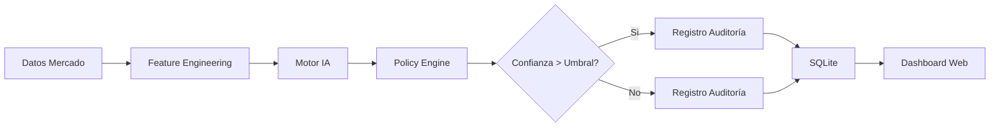

# Sistema de Luces Multi-Activo con IA y Observabilidad

Sistema automatizado de trading algorítmico que combina análisis técnico, inteligencia artificial híbrida y observabilidad en tiempo real. Diseñado para operar múltiples activos (US500, XAUUSD, TSLA, AAPL) de forma independiente con registros de auditoría completos.

## 📋 Tabla de Contenidos

- [Características Principales](#características-principales)
- [Arquitectura del Sistema](#arquitectura-del-sistema)
- [Requisitos Previos](#requisitos-previos)
- [Instalación](#instalación)
- [Configuración Multi-Activo](#configuración-multi-activo)
- [Ejecución del Sistema](#ejecución-del-sistema)
- [Operación Diaria](#operación-diaria)
- [Interpretación de Señales](#interpretación-de-señales)
- [Estructura de Directorios](#estructura-de-directorios)
- [Solución de Problemas](#solución-de-problemas)
- [Advertencias de Riesgo](#advertencias-de-riesgo)

---

## Características Principales

- **Multi-Activo**: Soporte nativo para US500 (S&P 500), XAUUSD (Oro), TSLA (Tesla) y AAPL (Apple).
- **Inteligencia Híbrida**: Motor de decisión que combina reglas expertas, estadística avanzada y detección de anomalías.
- **Fuente de Datos**: Conexión a Yahoo Finance para obtener velas en tiempo real vía WebSocket y REST.
- **Auditoría Completa**: Registro persistente en SQLite de cada decisión, señal de IA y evento de mercado.
- **Dashboard Web**: Interfaz en tiempo real para monitoreo de estados, luces y métricas de rendimiento.
- **Seguridad Operativa**: Umbrales de confianza configurables, modo "Shadow" (solo simulación) y validación de datos.

---

## Arquitectura del Sistema

El sistema opera en un ciclo continuo de 5 etapas:

1.  **Ingesta de Datos**: Conexión a Yahoo Finance mediante WebSocket multi-símbolo y REST como respaldo.
2.  **Feature Engineering**: Cálculo de indicadores técnicos (RSI, MACD, Bandas de Bollinger, ATR).
3.  **Inferencia de IA**: El motor analiza las características, detecta anomalías y asigna una puntuación de confianza.
4.  **Decisión de Política**: El PolicyEngine combina la señal de IA con reglas de negocio para definir la "Luz" (Verde/Rojo/Amarillo).
5.  **Registro y Visualización**: Los eventos se persisten en SQLite y se exponen vía dashboard web.



---

## Requisitos Previos

### Software Obligatorio
- **Python 3.11** (requerido por el proyecto)
- **uv** (gestor de paquetes y entorno virtual)
- **Git**

### Conocimientos Recomendados
- Nociones básicas de trading (Long/Short, Stop Loss, Take Profit).
- Manejo básico de terminal Linux/Consola.

---

## Instalación

### 1. Clonar el Repositorio
```bash
git clone <URL_DEL_REPOSITORIO>
cd SistemaLuces
```

### 2. Instalar Dependencias con uv
```bash
UV_CACHE_DIR=.cache/uv uv sync
```

*Nota: El proyecto usa `uv` como gestor de paquetes. Si no lo tienes instalado:*
```bash
curl -LsSf https://astral.sh/uv/install.sh | sh
```

### 3. Verificar Instalación
Ejecuta el script de verificación documental:
```bash
python3.11 -B scripts/verificar_documentacion.py
```

---

## Configuración Multi-Activo

La configuración centralizada se encuentra en `src/sistema_luces/config/`. Aquí se definen los parámetros críticos para cada instrumento.

### Parámetros Clave por Activo

| Parámetro | Descripción | Ejemplo (US500) |
| :--- | :--- | :--- |
| `symbol_yahoo` | Símbolo para obtención de datos | `^GSPC` |
| `umbrales_luz` | Tupla (Min, Max) para luz Verde/Roja | `(35.0, 65.0)` |
| `confianza_minima` | Score mínimo de IA para operar | `0.75` |
| `trading_enabled` | Habilitar/Deshabilitar ejecución real | `False` (Shadow) |

### Cómo Añadir un Nuevo Activo
1.  Abre el archivo de configuración correspondiente en `src/sistema_luces/config/`.
2.  Copia un bloque existente y ajusta los parámetros según la volatilidad del nuevo activo.
3.  Reinicia el servidor.

---

## Ejecución del Sistema

### Modo Monitor Multi-Activo (Recomendado)
Este comando inicia el núcleo del sistema con fuente Yahoo Finance para todos los activos configurados.

```bash
UV_CACHE_DIR=.cache/uv uv run python -B scripts/ejecutar_yahoo_sp500.py
```

**Salida esperada:**
```text
[INFO] Iniciando monitor multi-activo...
[INFO] Suscripción WebSocket establecida para ^GSPC, TSLA, AAPL, GC=F
[INFO] Dashboard disponible en http://127.0.0.1:8080
```

### Modo Replay Demostrativo
Para pruebas con datos históricos y diagnóstico completo:

```bash
python3.11 -B scripts/ejecutar_demo_vivo.py
```

### Modo Servidor con Event Log Existente
Si ya tienes una base de datos de eventos:

```bash
python3.11 -B scripts/iniciar_servidor_luces.py --db-path /ruta/al/luces.db
```

### Flags de Ejecución Útiles
- `--db-path`: Ruta al archivo SQLite de eventos.
- El monitor Yahoo permanece activo hasta `Ctrl+C`. Fuera de sesión conserva el último valor y muestra `MERCADO CERRADO`.

---

## Operación Diaria

### 1. Inicio de Sesión
1.  Ejecutar el monitor multi-activo (`scripts/ejecutar_yahoo_sp500.py`).
2.  Verificar en los logs: `[INFO] Dashboard disponible en http://127.0.0.1:8080`.

### 2. Monitoreo
Accede al dashboard web (`http://127.0.0.1:8080`) para observar:
- **Estado de las Luces**: Verde (Compra fuerte), Rojo (Venta fuerte), Amarillo (Neutral/Esperar).
- **Confianza IA**: Porcentaje de certeza de la predicción actual.
- **Timestamp y Latencia**: Indica cuándo cambió realmente la fuente de datos.

### 3. Intervención Manual
- **Pausar Trading**: El sistema opera en modo Shadow por defecto (sin ejecución real).
- **Cerrar Sesión**: Detener el proceso con `Ctrl+C`. El dashboard mostrará el último estado conocido.

### 4. Cierre de Sesión
1.  Detener el monitor Python (`Ctrl+C`).
2.  Revisar el archivo `data/auditoria.db` o el dashboard para validar las señales del día.

---

## Interpretación de Señales

El sistema utiliza un semáforo intuitivo basado en la convergencia de múltiples factores:

| Luz | Significado | Acción Sugerida | Condición IA |
| :--- | :--- | :--- | :--- |
| 🟢 **VERDE** | Tendencia Alcista Fuerte | Considerar Compra (Long) | Confianza > 75% + Sin Anomalías |
| 🔴 **ROJO** | Tendencia Bajista Fuerte | Considerar Venta (Short) | Confianza > 75% + Sin Anomalías |
| 🟡 **AMARILLA** | Mercado Lateral o Incierto | No Operar (Esperar) | Confianza < 75% o Datos Insuficientes |
| ⚪ **BLANCA** | Sin Datos o Error | Verificar Conexión | Error en ingesta de datos |

**Nota Importante**: Una luz Verde/Roja no garantiza ganancias. Indica una probabilidad estadística favorable según el modelo actual.

---

## Estructura de Directorios

```text
SistemaLuces/
├── src/
│   └── sistema_luces/
│       ├── application/        # Casos de uso (shadow, replay, query)
│       ├── config/             # Configuraciones multi-activo
│       ├── domain/             # Modelos de dominio y contratos
│       ├── feed/               # Ingesta de datos (Yahoo, WebSocket)
│       ├── learning/           # Motor de Inteligencia Artificial
│       ├── policy/             # Policy Engine y reglas de decisión
│       ├── presentation/       # Vistas y presentadores
│       ├── quant/              # Indicadores y microestructura
│       ├── simulation/         # Simulación de órdenes
│       ├── storage/            # Persistencia SQLite
│       ├── ui/                 # Servidor Web y Dashboard
│       └── sources/            # Fuentes de datos externas
├── scripts/
│   ├── ejecutar_yahoo_sp500.py # Monitor multi-activo principal
│   ├── ejecutar_demo_vivo.py   # Replay demostrativo
│   ├── iniciar_servidor_luces.py # Servidor con DB existente
│   └── verificar_documentacion.py # Verificación de integridad
├── data/
│   └── auditoria.db            # Base de datos SQLite (auto-generada)
├── docs/                       # Documentación técnica y specs
├── tests/                      # Suite de pruebas unitarias
├── pyproject.toml              # Configuración del proyecto
└── README.md                   # Este manual
```

---

## Solución de Problemas

### Las luces nunca cambian de Amarillo
- **Causa**: Umbral de confianza demasiado alto o mercado lateral.
- **Solución**: Verifica que los datos de Yahoo Finance estén llegando correctamente. Revisa el timestamp en el dashboard.

### Error: "No se puede conectar a Yahoo Finance"
- **Causa**: Problema de conexión a internet o API rate-limited.
- **Solución**: Verifica tu conexión. El sistema usa REST como respaldo si WebSocket falla.

### El dashboard muestra "NO_DATA"
- **Causa**: No hay event log cargado o el mercado está cerrado.
- **Solución**: Ejecuta el monitor Yahoo (`ejecutar_yahoo_sp500.py`) para generar datos en tiempo real.

### Timestamp desactualizado
- **Causa**: Mercado cerrado o desconexión de la fuente.
- **Solución**: El dashboard muestra explícitamente `MERCADO CERRADO` fuera del horario de trading. Espera la apertura.

---

## Advertencias de Riesgo

> **IMPORTANTE**: Este software es una herramienta de asistencia para la toma de decisiones. No garantiza beneficios económicos.

1.  **Riesgo de Pérdida**: El trading de CFDs, Futuros y Acciones conlleva un alto riesgo. Puedes perder más de tu depósito inicial.
2.  **Uso en Demo**: Se recomienda encarecidamente operar en cuenta **DEMO** durante al menos 20 sesiones (aprox. 1 mes) antes de usar capital real.
3.  **Fallos Técnicos**: Errores de conexión a internet o caídas de la fuente de datos pueden resultar en señales desactualizadas. Mantén supervisión humana constante.
4.  **Sobre-ajuste**: Los modelos de IA están entrenados con datos históricos. El comportamiento futuro del mercado puede diferir drásticamente.
5.  **Fuente de Datos**: Yahoo Finance publica precios pero no certifica bid/ask ejecutables ni demora cero. El sistema muestra la antigüedad de los datos explícitamente.

**Responsabilidad**: El usuario asume toda la responsabilidad por las operaciones realizadas con este sistema. Los desarrolladores no se hacen responsables de pérdidas financieras directas o indirectas.

---

## Soporte y Actualizaciones

Para reportar errores o sugerir mejoras, por favor abre un "Issue" en el repositorio del proyecto adjuntando:
- Versión del sistema.
- Fragmento del log relevante al error.
- Captura de pantalla del dashboard (si aplica).

### Documentación Técnica

- [Autoridad del producto](./ORIGINAL_REQUEST.md)
- [SPEC-002: Integración futura Trading Journal](./docs/specs/SPEC-002-integracion-futura-trading-journal.md)
- [SRS](./docs/SRS.md)
- [Arquitectura](./docs/ARQUITECTURA.md)
- [Sistema visual](./docs/SISTEMA-VISUAL.md)
- [Trazabilidad](./docs/TRAZABILIDAD.md)

El [índice documental](./docs/README.md) explica qué es canónico, qué es evidencia y qué quedó supersedido.

*Versión del Documento: 2.0 - Monitor Multi-Activo con Yahoo Finance*
